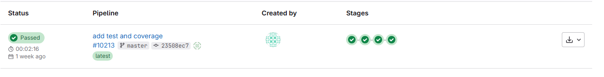

# Projet de tutoriel pour tester un déploiement sur Cloud Pi Native

## Description de l'application

Cette application est un backend Java listant des données en base de données. Les données présentes dans le fichier ```src\main\resources\db\data\demo.csv``` sont automatiquement chargées lors du premier démarrage de l'application :
```csv
id;name
1;Alice
2;Bob
3;Charles
4;Denis
5;Emily
```

## Compilation et construction de l'application

La génération de l'artefact Java (.jar) de l'application s'effectue par la commande ```mvn package``` et la construction de l'image Docker associée se fait par la commande : ```docker build -t <mon_tag> -f Dockerfile .``` à la racine du projet une fois que l'artefact applicatif est généré.

Dckerfile :
```Dockerfile
FROM bitnami/java:17
WORKDIR /app
COPY target/*.jar app-java-forge-demo.jar
ENTRYPOINT ["java","-jar","app-java-forge-demo.jar"]
EXPOSE 8080
```

La construction de l'image applicative s'effectue donc par les étapes suivantes :
1. Compilation et construction de l'artefact applicatif : ```mvn package```
2. Construction de l'image Docker ```docker build```
3. Envoi de l'image construire dans le référentiel d'image ```docker push```

## Intégration à la chaine CPiN

### Ajout du dépôt externe

Nous allons détailler l'intégration de cette application de démo à l'offre Cloud Pi Native sur la plateforme d'accéleration.

Dans un premier temps il est nécessaire de créer un *projet*, puis d'ajouter le *repo de code* :

1. Depuis un *projet*, aller dans l'onglet *Dépôt*, puis *ajouter un nouveau dépôt* :

 - *Nom du dépôt Git interne* : demo-java

Le repo ne contient pas de code d'infrastructure et il possède des sources donc laisser les valeurs par défaut de la case à cocher et du radio bouton correspondant.

2. Renseigner *l'URL du repo externe* [https://github.com/cloud-pi-native/tuto-java.git](https://github.com/cloud-pi-native/tuto-java.git). Le repo est public, laissez donc décocher la case *Dépôt de source privé*

Cliquez sur le bouton *Ajouter le dépôt* et attendre que le dépôt apparaisse dans la console.

3. depuis l'onglet *Services externes* vérifier en cliquant sur le service Gitlab que le dépôt *demo-java* est bien présent dans ses projets gitlab.

### Ajout du fichier gitlab-ci

Gitlab est configurée pour utiliser un fichier gitlab-ci nommé **.gitlab-ci-dso.yml** à la racine du projet.

Pour des raisons de facilité, nous allons travailler à partir du repo de code de gitlab et non depuis la source, dans un mode projet, il conviendrait de travailler depuis le repo externe et de procéder à des synchronisation repo externe -> repo interne.

1. Depuis Gitlab, aller dans le projet *demo-java* et choisir la branche *tuto* puis sur le bouton *edit* -> *web IDE* créer un fichier .gitlab-ci-dso.yml

2. Ajouter la première partie suivante :

```yaml
include:
  - project: $CATALOG_PATH
    file:
      - vault-ci.yml
      - kaniko-ci.yml
      - java-mvn.yml
    ref: main
```

Cette partie permet de charger les taches pré-définies et pré-paramétrée pour s'exécuter dans CPiN. Pour plus d'information sur le catalogue, voir le repo [dédié](https://github.com/cloud-pi-native/gitlab-ci-catalog)

Ajouter ensuite la partie suivante qui permet de définir les valeurs à mettre en cache, les variables et les étapes de construction:

```yaml
cache:
  paths:
    - .m2/repository/
    - node_modules

variables:
  TAG: "${CI_COMMIT_REF_SLUG}"
  DOCKERFILE: Dockerfile
  REGISTRY_URL: "${IMAGE_REPOSITORY}"

stages:
  - read-secret
  - build-app
  - test-app
  - docker-build
  ```

la construction du projet se fait en plusieurs étapes :
1. Lecture des secrets du projet (token gitlab, Nexus, Sonarqube etc.) par la tache vault-ci
2. Construction de l'applicatif via la tache java-mvn
3. Exécution des tests unitaires
4. Construction de l'image docker et push vers Harbor par la tache kaniko-ci

#### Lecture des secrets

Ajouter le bloc suivant pour lire les secrets du projet depuis Vault :

```yaml
read_secret:
  stage: read-secret
  extends:
    - .vault:read_secret
```

#### Construction de l'application

Ajouter le bloc suivant pour la construction de l'application Java

```yaml
package-app:
  variables:
    MAVEN_OPTS: "-Dmaven.repo.local=$CI_PROJECT_DIR/.m2/repository"
    MAVEN_CLI_OPTS: ""
    MVN_CONFIG_FILE: $MVN_CONFIG
    BUILD_IMAGE_NAME: maven:3.8-openjdk-17
    WORKING_DIR: .
    ARTEFACT_DIR: ./target/*.jar
  stage: build-app
  extends:
    - .java:build
```
Ce bloc est une extension de la tache suivante qui exécute un mvn clean package en se positionnant dans le répertoire $WORKING_DIR et avec la possibilité d'ajouter des configuration supplémentaires par les variables $MAVEN_OPTS et $MAVEN_CLI_OPTS et génère l'artefact dans le répertoire $ARTEFACT_DIR

Pour information, le bloc ci-dessus est une extension de la tache suivante issue du catalogue:
```yaml
.java:build:
  extends: .java:init
  script:
    - cd $WORKING_DIR
    - echo ${PROJECT_PATH}
    - mvn $MAVEN_CLI_OPTS clean package -gs $MVN_CONFIG_FILE
  artifacts:
    paths:
      - ${ARTEFACT_DIR}
    expire_in: 1 seconds
  interruptible: true
```

#### Test unitaire de l'application
Ajouter la partie test unitaire sur le même principe :
```yaml
test-app:
  variables:
    MAVEN_OPTS: "-Dmaven.repo.local=$CI_PROJECT_DIR/.m2/repository"
    MAVEN_CLI_OPTS: ""
    MVN_CONFIG_FILE: $MVN_CONFIG
    BUILD_IMAGE_NAME: maven:3.8-openjdk-17
    WORKING_DIR: .

  stage: test-app
  extends:
    - .java:sonar
```

#### Construction de l'image et déploiement sur Harbor

Ajouter enfin le bloc suivant pour construire et déployer l'image Docker sur Harbor :

```yaml
docker-build:
  variables:
    WORKING_DIR: "."
    IMAGE_NAME: java-demo
  stage: docker-build
  extends:
    - .kaniko:simple-build-push
```

Pour information, le bloc ci-dessus est une extension de la tache suivante issue du catalogue:

```yaml
.kaniko:simple-build-push:
  variables:
    DOCKERFILE: Dockerfile
    WORKING_DIR: .
    IMAGE_NAME: $IMAGE_NAMES
    EXTRA_BUILD_ARGS: ""
  image:
    name: gcr.io/kaniko-project/executor:debug
    entrypoint: [""]
  script:
    # CA
    - if [ ! -z $CA_BUNDLE ]; then cat $CA_BUNDLE >> /kaniko/ssl/certs/additional-ca-cert-bundle.crt; fi
    - mkdir -p /kaniko/.docker
    - echo "$DOCKER_AUTH" > /kaniko/.docker/config.json
    - /kaniko/executor --build-arg http_proxy=$http_proxy --build-arg https_proxy=$https_proxy --build-arg no_proxy=$no_proxy $EXTRA_BUILD_ARGS --context="$CI_PROJECT_DIR" --dockerfile="$CI_PROJECT_DIR/$WORKING_DIR/$DOCKERFILE" --destination $REGISTRY_URL/$IMAGE_NAME:$TAG
```

#### Une autre approche via un Dockerfile multi-stage

L'application construite ci-dessus est basée sur gitlab-ci pour consturire l'applicatif puis l'injecter dans une image Docker. Il est également possible de définir un Dockerfile multi-stage pour construire l'application java et l'injecter dans une image Docker. Dans cette approche, le dockerfile contient la partie build applicative et buld Docker. Ainsi il n'est plus nécessaire de faire les étapes *test-app* et build-app* mais uniquement *build-docker* en utilisant le fichier Dockerfile *DockerfileMultiStage*.
 Il faudra cependant injecter les variables nécessaires au build de l'application en EXTRA_BUILD_ARGS et ajouter un script pour copier le fichier settings.xml dans le répertoire de travail.

```yaml
docker-build:
  variables:
    WORKING_DIR: "."
    IMAGE_NAME: java-demo
    DOCKERFILE: DockerfileMultiStage
    EXTRA_BUILD_ARGS: --build-arg MVN_CONFIG=${MVN_CONFIG_FILE} --build-arg PROJECT_PATH=${PROJECT_PATH} --build-arg NEXUS_USERNAME=${NEXUS_USERNAME} --build-arg NEXUS_PASSWORD=${NEXUS_PASSWORD}
  stage: docker-build
  before_script:
    - cat $MVN_CONFIG_FILE > settings.xml
  extends:
    - .kaniko:simple-build-push
```

Pour information voici le contenu du fichier DockerfileMultiStage :
```Dockerfile
# First stage: complete build environment
FROM maven:3.9.7-eclipse-temurin-21 AS builder

# arg for config and secret
ARG MVN_CONFIG
ARG PROJECT_PATH
ARG NEXUS_USERNAME
ARG NEXUS_PASSWORD

# copy settings.xml
ADD settings.xml /usr/share/maven/ref/settings.xml

# add pom.xml and source code
ADD ./pom.xml pom.xml
ADD ./src src/
RUN mvn clean package -Dmaven.test.skip=true -s /usr/share/maven/ref/settings.xml

# Second stage: copy file from stage one and build Java image
FROM bitnami/java:21
WORKDIR /app
# Copy from builder image
COPY --from=builder target/*.jar app.jar

ENTRYPOINT ["java","-jar","/app/app.jar"]
EXPOSE 8080
```

### Fichier .gitlab-ci-dso.yml complet
Le fichier .gitlab-ci-dso.yml complet est le suivant :

```yaml
include:
  - project: $CATALOG_PATH
    file:
      - vault-ci.yml
      - kaniko-ci.yml
      - java-mvn.yml
    ref: main

# default:
#  tags:
#    - ADD_CUSTOM_TAG_HERE

cache:
  paths:
    - .m2/repository/
    - node_modules

variables:
  TAG: "${CI_COMMIT_REF_SLUG}"
  DOCKERFILE: Dockerfile
  REGISTRY_URL: "${IMAGE_REPOSITORY}"

stages:
  - read-secret
  - build-app
  - test-app
  - docker-build

read_secret:
  stage: read-secret
  extends:
    - .vault:read_secret

package-app:
  variables:
    MAVEN_OPTS: "-Dmaven.repo.local=$CI_PROJECT_DIR/.m2/repository"
    MAVEN_CLI_OPTS: ""
    MVN_CONFIG_FILE: $MVN_CONFIG
    BUILD_IMAGE_NAME: maven:3.8-openjdk-17
    WORKING_DIR: .
    ARTEFACT_DIR: ./target/*.jar

  stage: build-app
  extends:
    - .java:build

test-app:
  variables:
    MAVEN_OPTS: "-Dmaven.repo.local=$CI_PROJECT_DIR/.m2/repository"
    MAVEN_CLI_OPTS: ""
    MVN_CONFIG_FILE: $MVN_CONFIG
    BUILD_IMAGE_NAME: maven:3.8-openjdk-17
    WORKING_DIR: .

  stage: test-app
  extends:
    - .java:sonar

docker-build:
  variables:
    WORKING_DIR: "."
    IMAGE_NAME: java-demo
  stage: docker-build
  extends:
    - .kaniko:simple-build-push
```

Et le fichier .gitlab-ci-dso.yml dans le cas d'un Docker multi-stage build 
```yaml
include:
  - project: $CATALOG_PATH
    file:
      - vault-ci.yml
      - kaniko-ci.yml
    ref: main

# default:
#  tags:
#    - ADD_CUSTOM_TAG_HERE

variables:
  TAG: "${CI_COMMIT_REF_SLUG}"
  DOCKERFILE: Dockerfile
  REGISTRY_URL: "${IMAGE_REPOSITORY}"

stages:
  - read-secret
  - docker-build

read_secret:
  stage: read-secret
  extends:
    - .vault:read_secret

docker-build:
  variables:
    WORKING_DIR: "."
    IMAGE_NAME: java-demo
    DOCKERFILE: DockerfileMultiStage
    EXTRA_BUILD_ARGS: --build-arg MVN_CONFIG=${MVN_CONFIG_FILE} --build-arg PROJECT_PATH=${PROJECT_PATH} --build-arg NEXUS_USERNAME=${NEXUS_USERNAME} --build-arg NEXUS_PASSWORD=${NEXUS_PASSWORD}
  stage: docker-build
  before_script:
    - cat $MVN_CONFIG_FILE > settings.xml
  extends:
    - .kaniko:simple-build-push

```

## Exécution de la chaine CI par gitlab

Une fois que ce fichier est créé et commit / push sur le repos git, retourner sur le projet gitlab *demo-java* puis dans le menu *build* -> *pipelines* puis cliquez sur le bouton *Run pipeline*

Le pipeline cherche automatiquement le fichier *.gitlab-dso.yaml* à la racine du projet et lance le pipeline.



> Bravo vous avez terminé le tutoriel de construction applicatif ! Prochaine étape le déploiement [ici](https://github.com/cloud-pi-native/tuto-java-infra-helm/tree/tuto)